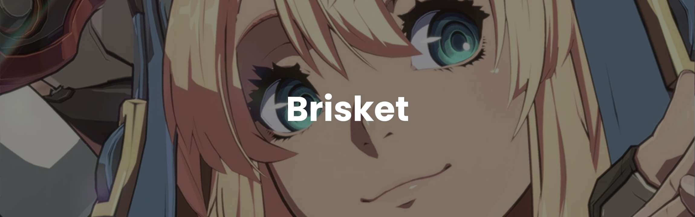

# Brisket: Diversity-based Deep RL for Fighting Game Behaviour Generaton



Brisket is an automated behaviour generation system for creating fighting game AI that exhibit diverse strategies from one another using deep reinforcement learning. 

On a high level, the approach involves training multiple agents concurrently, rewarding each agent based on their diversity from one another according to a learned discriminator. We then fine-tune these agents individually on a general reward function with the goal of creating agents of a similar difficulty that are diverse from one another. 

This repository contains code required to generate an arbitrary number of agents, along with means of evaluating said agents. We provide 3 pre-trained diverse agents created using this approach, along with 3 agents using more traditional deep reinforcement learning 

Technical details of how the Brisket approach works and an initial evaluation of the approach are covered in "Diversity-based Deep Reinforcement Learning Towards Multidimensional Difficulty for Fighting Game AI" (pdf link soon), an upcoming workshop paper at [EXAG 2022](https://www.exag.org/). If you use this work in any capacity in a research project or publication, please include the following citation.

```
(citation information coming soon. . .)
```

This repository builds off the [existing gym environment](https://github.com/TeamFightingICE/Gym-FightingICE) maintained by the developers of FightingICE. Check out the [official FightingICE website](http://www.ice.ci.ritsumei.ac.jp/~ftgaic/) for more information about FightingICE and its associated AI competitions.

Banner generated from [this website](https://liyasthomas.github.io/banner/), with art taken from [Guilty Gear -Strive-](https://www.guiltygear.com/ggst/en/)

## Requirements

Python ≥ 3.8 and pip ≥ 20.0.2
<br />
Java ≥ OpenJDK 8 (Oracle OpenJDK 11 is not supported) or equivalent

See [this page](http://www.ice.ci.ritsumei.ac.jp/~ftgaic/index-2.html) for additional requirements for FightingICE.

## Install
Run the following commands to install the repository along with the required Python packages.
```bash
git clone repo-url
cd repo-folder
pip3 install -r requirements.txt
```

After installation, ensure that gym is set up properly. See [this readme](https://github.com/TeamFightingICE/Gym-FightingICE) for more details.

# Training from Scratch

### Initalization
The following procedure will allow you to train any number of models from scratch. Here, let n denote the number of agents you wish to train (where n is a positive integer).

Initialize each agent with the following script.
```bash
python3 init_diayn.py n
```

If you'd like, you can test if the agents have been initialized correctly using this script as well (should be n distinct agents that output different values for the same randomized input).


### Diversity Step
The first step of the approach trains the agents to be as diverse as possible from one another using a learned discriminator. To do this, run the following script to train the agents.
```bash
python3 diaynexe.py n
```
The accuracy of the discriminator between episodes will be saved in results.csv. If things are working correctly, this accuracy should be monotonically increasing toward 100% until convergence.

### Fine-tuning Step
The second step of the approach fine-tunes the agents using a generalized reward function to encourage them to actually try to win the game! For each agent, run the following script, changing the "name" parameter on line 17 to the name of your model to train.
```bash
python3 gymexe.py
```
The performance of the trained agent is measured by the average reward across on 9 evaluation games played between episodes using greedy action selection. These results are saved in results.csv.

# Evaluation
To evaluate agents against one another, you need to modify a couple of flags in different files. 
1. In gym_exe.py, set "training" and "train_eval" to false, and "test_eval" to true (on lines 19-21 respectively). Replace the models listed in "model_list" with the names of your agents.
2. In gym_fightingice/envs/RandomAI.py, set "self.tournament" to true on line 49. Replace the parameter of self.architecture on line 53 to the name of your desired model.
3. Run gymexe.py to have your agents fight!

The evaluation is set up this way in order to facilitate a round-robin tournament without having to go into the fightingICE environment and change the name of the opponent, which is a massive headache to get working properly.

The results of each of the matches are automatically recorded in tourney_results.csv.

As well, there is an additional evaluation used in the paper that measures the diversity 

# Provided Agents
We provide 6 pre-trained agents for your use and perusal! 3 of these agents were learned using Brisket, while the other 3 were learned using a traditional Deep Q approach. These agents can be found in models/FinalAI.

Below is a video demonstrating each of the listed agents, along with a description of each agent.

[](http://www.youtube.com/watch?v=GnoURvbHMLY "Video Title")

## Brisket Agents

These agents were trained using Brisket.

**Combo** (Skill 1 Combo) is an agent characterized by its chaining of fast moves together.
The agent uses a wide variety of moves depending on the situation, and has learned a difficult-to-escape combo that traps the opponent in the corner.

**Rushdown** (Skill 2 Rushdown) is an agent which quickly approaches the opponent to relentlessly attack. The agent frequently switches between high and low attacks, making it difficult for an opponent to effectively block or defend themself.

**Sweeper** (Skill 3 Sweeper) is an agent that chooses to use a low sweeping kick in almost every circumstance.
The agent has learned to effectively chain these sweeps together, keeping the enemy permanently knocked down unless they correctly block or evade the attack.

## Deep Q Agents using Human-authored Reward Functions

These agents were trained using a Deep Q approach that used human-authored reward functions. For details on these reward functions, please see the corresponding paper (paper pdf link soon).

**Aggressive** (HA 1 Aggressive) is the simplest form of this ``uppercut'' strategy, attempting to chain uppercuts against the opponent without caring for self-preservation.

**Balanced** (HA 2 Balanced) occasionally mixes up this base strategy with faster kicks, and has a higher preference toward throwing projectiles than the other human-authored agents.

**Counter** (HA 3 Counter) agent also tweaks this base strategy by focusing more on uppercutting than throwing projectiles.Instead of using energy on throwing projectiles, this agent performs a sliding kick move that goes under most other moves, allowing the agent to effectively "counter hit" the opponent mid-move.


# Notes & Warnings
By default, both of the training steps are set to last for 50 episodes. You can tweak the training parameters at the top / throughout the code to your liking if needed. 

By default, games are played against an agent using random action selection, i.e. at each timestep, the agent chooses a random action. This can be changed in the gym_fighting/envs/gym_ai.py

You can use the gymexe.py script in order to train a regular Deep-Q agent using a custom defined reward function. You can edit the reward function used directly in gym_fighting/envs/gym_ai.py. Three of the provided agents are trained using this method, and their performance is compared and contrasted against skills learned using Brisket in our paper.

The state of each agent is saved at the end of each training episode. You can use the helper.py script to easily locate the file for an agent from a desired training episode.

⚠️ Due to a bug with FightingICE, you may experience an unavoidable crash after 37 training episodes. If this occurs, simply resume training, changing line 49 to resume from your last episode.

⚠️ You will need to change information such as file paths to match your machine. To do this, change the PATH variable in the appropriate files.

⚠️ Currently, the code is set up to work on Windows. Some changes (such as file paths) will need to be made to the code / FightingICE setup in order for it to work on other OS.

⚠️ The gymexe.py (and a lot of the code in general) file is kind of a mess. Sorry! This was around a 9 month long project that needed to be ported from different environments multiple times, which led to a lot of indeal stuff. However, I've tried my best to make it as usuable as possible (also by providing this readme). Maybe I'll make it less of a mess in the future, but I have a lot to work on right now!

⚠️ Extraneous requirements may exist in the requirements.txt file. Sorry!

## License and Attribution
This respository uses the [MIT license.](https://choosealicense.com/licenses/mit/)

Please cite my paper (info above) if you use my code in an academic work, and please link to the github if you use it in another context!

Thanks :D
